# 实验一 CSR / SSR / SSG 渲染对比

| 项目 | 内容 |
|---|---|
| 班级 | 24软件1 |
| 姓名 | 黄粤 |
| 学号 | 2024085144009 |
| 实验周次 | 第 2 周 |
| 仓库地址 | https://github.com/hy1840800628/se3306-exp1 |
| 完成日期 | 2026-10-08 |

---

## 一、实验目的

1. 直观理解 CSR / SSR / SSG 三种渲染模式的执行流程与本质区别。
2. 用首屏 HTML 大小、FCP、LCP、SEO 可见性等指标量化三种模式的差异。
3. 建立渲染模式选型的工程判断力：内容变不变？要不要个性化？首屏多敏感？
4. 理解 SPA 之后 SSR 为什么回归、SSG 为什么稳定，以及 ISR / 混合渲染的补充作用。

---

## 二、实验环境

| 工具 | 版本 / 说明 |
|---|---|
| 操作系统 | Windows 11 |
| Node.js | 20+ |
| pnpm | 12.9.1 |
| Chrome | 含 DevTools |
| VS Code | 代码编辑 |
| 技术栈 | Vite 6 + 原生 JS + Express + Node 构建脚本 |

---

## 三、实验原理

### 3.1 三种渲染模式

- **CSR 客户端渲染**：服务器返回空 HTML 骨架 + JS 引用，浏览器下载并执行 JS 后渲染页面。首屏慢、SEO 差，交互体验好。
- **SSR 服务端渲染**：服务器每次请求时拼接完整 HTML 返回，首屏快、SEO 好；水合后恢复交互。
- **SSG 静态站点生成**：构建期生成静态 HTML，部署到 CDN，访问时直接返回文件。最快、最稳，内容更新需重新构建。
- **ISR 增量静态再生成**：SSG 的补充，设置 revalidate 时间，过期后后台重新生成页面，兼顾静态速度与内容更新。

### 3.2 Web Vitals 指标

| 缩写 | 全称 | 中文名 | 衡量目标 | 优秀线 |
|---|---|---|---|---|
| LCP | Largest Contentful Paint | 最大内容绘制 | 主内容多久显示 | ≤2.5 秒 |
| INP | Interaction to Next Paint | 交互到下一帧绘制 | 点击是否卡顿 | ≤200 毫秒 |
| CLS | Cumulative Layout Shift | 累积布局偏移 | 内容是否乱跳 | ≤0.1 |

本实验重点测量：首屏 HTML 大小、FCP、LCP、SEO 可见性。

---

## 四、实验任务与步骤

### 任务一：Vite 纯 CSR 应用

#### 1. 创建项目

```bash
pnpm create vite lab1-csr --template vanilla --no-interactive
cd lab1-csr
pnpm install
pnpm run dev
```

开发服务器默认地址：`http://localhost:5173`

#### 2. 核心代码 `src/main.js`

```js
const posts = Array.from({ length: 10 }, (_, i) => ({
  id: i + 1,
  title: `文章标题${i + 1}`,
  body: `这是第${i + 1}篇文章的正文内容...`,
}));

const app = document.getElementById("app");

app.innerHTML =
  "<h1>文章列表</h1>" +
  posts
    .map(
      (p) => `<article><h2>${p.title}</h2><p>${p.body}</p></article>`
    )
    .join("");
```

#### 3. 自检与截图

- [x] 页面能看到 10 篇文章。
- [x] 右键“查看网页源代码”，`<div id="app">` 内是空的，证明 CSR 是空壳。
- [x] Network 面板能看到 `main.js` 请求。

截图：

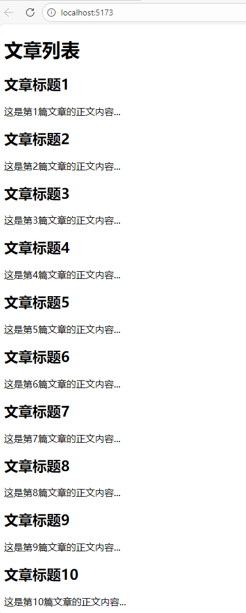

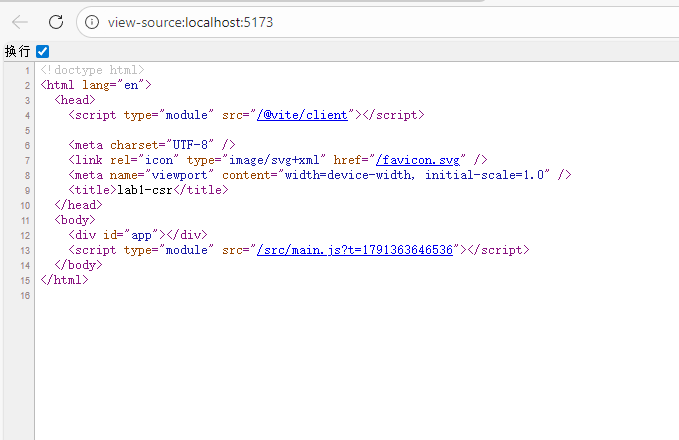

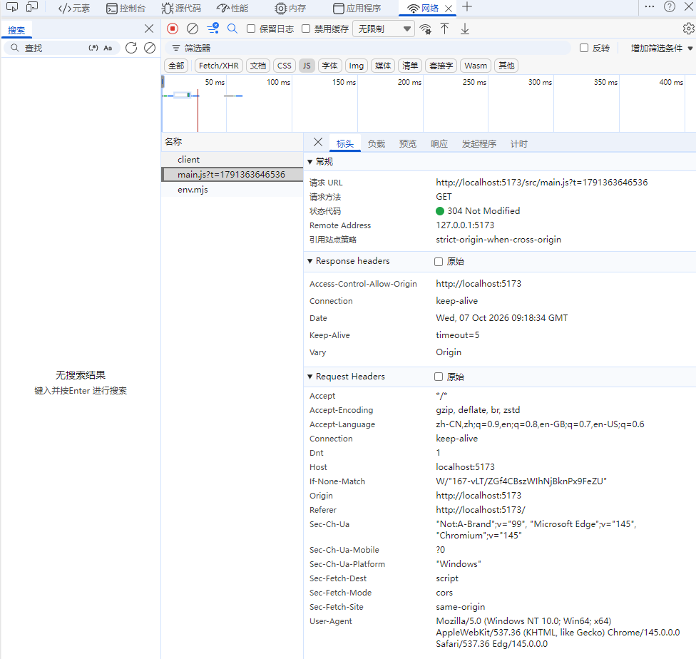

---

### 任务二：Express 实现 SSR

#### 1. 初始化项目

```bash
mkdir lab1-ssr
cd lab1-ssr
pnpm init
pnpm add express
```

> 注意：如果 `package.json` 里有 `"type": "module"`，`server.js` 要使用 ESM 写法 `import express from "express";`。

#### 2. 核心代码 `server.js`

```js
import express from "express";

const app = express();

const posts = Array.from({ length: 10 }, (_, i) => ({
  id: i + 1,
  title: `文章标题${i + 1}`,
  body: `这是第${i + 1}篇文章的正文内容...`,
}));

app.get("/", (req, res) => {
  const now = new Date().toLocaleString();

  const html = `
    <!DOCTYPE html>
    <html>
      <head>
        <meta charset="UTF-8" />
        <title>SSR 文章列表</title>
      </head>
      <body>
        <h1>文章列表</h1>
        <p>服务器生成时间：${now}</p>
        ${posts
          .map(
            (p) => `<article><h2>${p.title}</h2><p>${p.body}</p></article>`
          )
          .join("")}
      </body>
    </html>
  `;

  res.send(html);
});

app.listen(3001, () => {
  console.log("SSR on http://localhost:3000");
});
```

#### 3. 运行

```bash
node server.js
```

访问：`http://localhost:3000`

#### 4. 自检与截图

- [x] 页面能看到 10 篇文章。
- [x] 查看网页源代码，正文直接在 HTML 中，SEO 友好。
- [x] 多次刷新页面，“服务器生成时间”会变化，证明服务器每次请求都现拼 HTML。

截图：

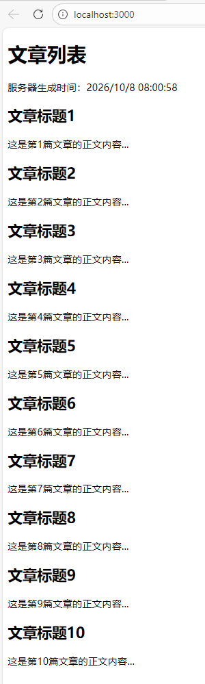

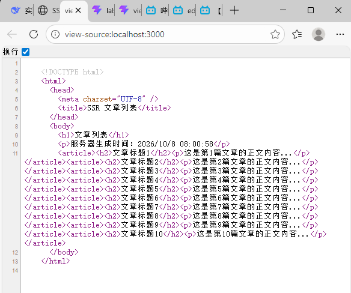

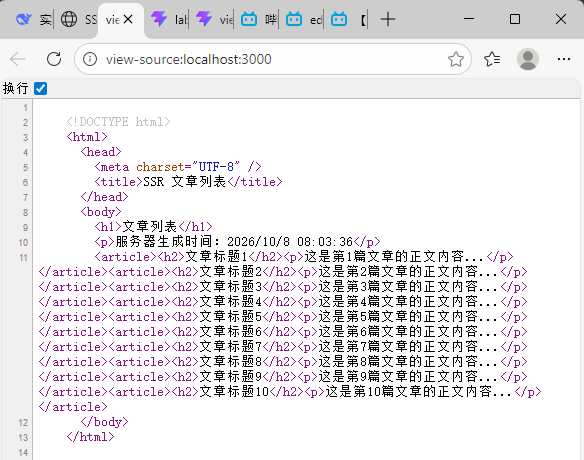

---

### 任务三：SSG 静态生成

#### 1. 新建项目

```bash
mkdir lab1-ssg
cd lab1-ssg
```

#### 2. 构建脚本 `build-ssg.js`

```js
const fs = require("fs");

const posts = Array.from({ length: 10 }, (_, i) => ({
  id: i + 1,
  title: `文章标题${i + 1}`,
  body: `这是第${i + 1}篇文章的正文内容...`,
}));

const html = `<!DOCTYPE html>
<html>
  <head>
    <meta charset="UTF-8" />
    <title>SSG 文章列表</title>
  </head>
  <body>
    <h1>文章列表</h1>
    ${posts
      .map(
        (p) => `<article><h2>${p.title}</h2><p>${p.body}</p></article>`
      )
      .join("")}
  </body>
</html>`;

fs.mkdirSync("dist", { recursive: true });
fs.writeFileSync("dist/index.html", html);

console.log("静态页面已生成到 dist/");
```

#### 3. 运行与预览

```bash
node build-ssg.js
npx serve dist
```

访问：`http://localhost:3000`

#### 4. 自检与截图

- [x] `dist/index.html` 生成成功。
- [x] 本地预览能访问。
- [x] 查看源代码，正文已在 HTML 中，且没有“服务器生成时间”，证明内容是构建时写死的。

截图：

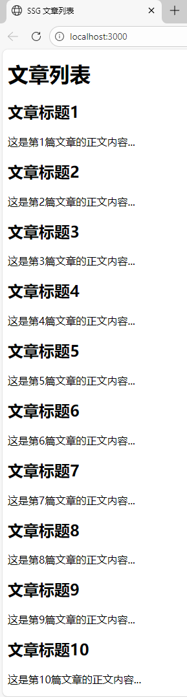

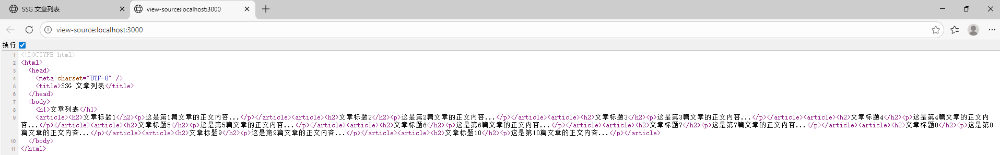

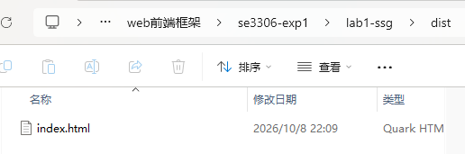

---

### 任务四：指标测量与对比

#### 1. 测量方式

- FCP / LCP：Chrome DevTools → Lighthouse → Analyze page load。
- 首屏 HTML 大小：右键“查看网页源代码” → 全选复制 → 记事本查看字节数。
- SEO 可见性：查看源代码是否含文章正文。

#### 2. 实测数据

| 模式 | 首屏 HTML 大小 | FCP | LCP | SEO 源码含正文？ | 适用场景 |
|---|---|---|---|---|---|
| CSR | 428 字节 | 0.5 秒 | 0.5 秒 | 否 | 后台系统、交互密集型 SPA |
| SSR | 1,125 字节 | 0.2 秒 | 0.2 秒 | 是 | 电商、新闻、需要 SEO 且内容动态 |
| SSG | 1,028 字节 | 0.2 秒 | 0.2 秒 | 是 | 博客、文档、营销页 |

截图：

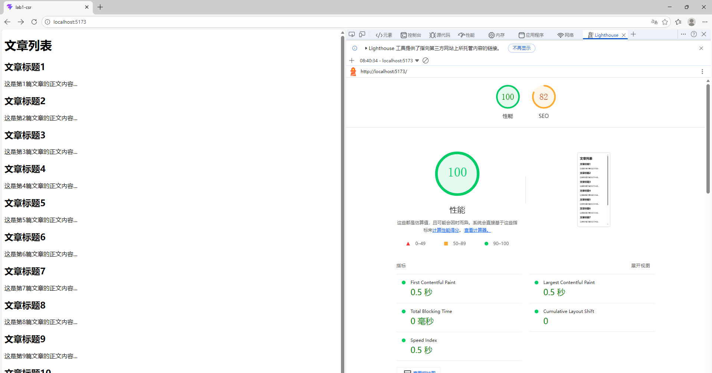

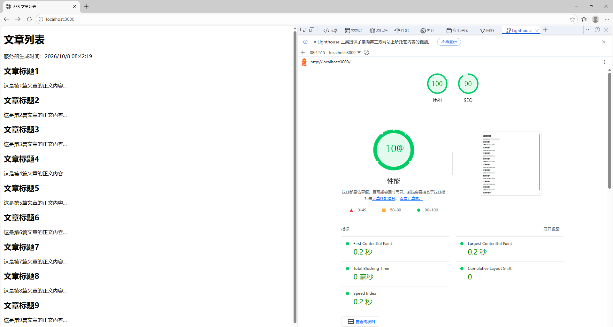

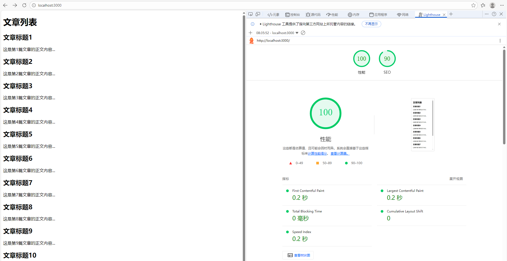

---

## 五、必答题

### （1）为什么 SPA 时代 SEO 差？

SPA 首屏 HTML 是空壳，正文依赖 JS 在浏览器运行时渲染。搜索引擎爬虫抓取到的源码里没有正文，只有 `<div id="app"></div>` 和 JS 引用，因此无法有效索引页面内容。虽然现代爬虫能执行部分 JS，但成本高、不稳定，所以 SPA 的 SEO 天然弱于 SSR / SSG。

### （2）SSG 与 SSR 的本质区别是什么？

本质区别是 HTML 生成时机：

SSG：构建时生成 HTML，之后服务器只发静态文件，零计算，最快最稳，但内容更新需要重新构建。
SSR：每次请求时由服务器现场拼接 HTML，能实时更新、可个性化，但需要服务器持续运行，有计算开销。

### （3）结合讲次 02 渲染模式演进的理论，写一段 200 字左右的总结。

从 CSR 到 SSR，再到 SSG / ISR，渲染模式演进的核心是“内容在哪里生成、什么时候生成”。SPA 交互好但首屏慢、SEO 差，于是 SSR 回归，把 HTML 生成提前到服务器；SSG 进一步提前到构建期，换来最快最稳的静态访问；ISR 则给 SSG 补上更新能力。选型可以用三问判断：内容变不变？要不要个性化？首屏多敏感？本实验用实测数据验证了这些结论：CSR 源码空壳，SSR 每次请求现拼，SSG 构建时写死。

### （4）前三个实验任务都启用了服务器，分别使用什么服务器？三种方式运行机制怎样？

CSR：Vite 开发服务器。它提供静态资源和 JS，浏览器下载 `main.js` 后执行渲染，首屏 HTML 是空壳。
SSR：Express 服务器。每次请求进来时，服务器现场拼接完整 HTML 并返回，正文直接出现在响应源码中。
SSG：`serve` 或 Python 静态文件服务器。构建期已生成 `dist/index.html`，服务器只负责发送静态文件，零计算。

### （5）实时更新的股票行情页，三种模式加上 ISR，哪个最合适？为什么？

SSR 最合适，也可以结合客户端 WebSocket / 轮询做实时推送。股票行情需要实时、可能个性化，SSG 更新不及时，CSR 首屏慢且 SEO 差。SSR 每次请求返回最新数据，首屏快、SEO 好。如果更新频率可容忍分钟级，ISR 也可以作为折中，但强实时场景仍以 SSR 为主。

### （6）为什么 SSR 需要水合 Hydration？没有水合会怎样？

SSR 返回的是静态 HTML，虽然用户能看到内容，但页面没有事件监听和客户端状态。水合就是让 React / Vue 等客户端框架接管这些静态 DOM，绑定事件、恢复交互。没有水合，页面只能看不能点，按钮、表单、路由跳转等交互都会失效。

---

## 六、选答题

### 选（7）什么条件下 SSG 是最优解？内容更新频繁时如何补救？

SSG 最适合：内容稳定、更新不频繁、访问量大、对首屏速度和 SEO 要求高、可部署到 CDN 的场景，例如博客、文档、营销页。

内容更新频繁时，可以用 **ISR** 补救：设置 `revalidate` 时间，过期后后台重新生成页面；也可以使用按需重新验证、增量构建，只重新生成变化的页面，兼顾静态速度和内容更新。

---

## 七、实验体会

通过本次实验，我亲手实现了 CSR、SSR、SSG 三种渲染模式，并测量了首屏 HTML 大小、FCP、LCP、SEO 可见性。最直观的体会是：

- CSR 的源码是空壳，正文靠 JS 渲染，所以 SEO 差；
- SSR 每次请求都重新拼 HTML，能实时更新，但需要服务器；
- SSG 构建时写死，访问最快最稳，但更新要重新构建。

这次实验让我理解了“渲染模式没有绝对好坏，只有适用场景不同”，也掌握了用 Web Vitals 和 DevTools 做性能验证的方法。

## 九、部署链接

| 模式 | 部署平台 | 链接 |
|---|---|---|
| CSR | 静态托管 | https://xxx |
| SSR | CloudBase / Render / Railway | https://xxx |
| SSG | 静态托管 | https://xxx |

---

## 十、AI 使用声明

见仓库根目录：`AI使用声明.md`。

---

## 十一、提交信息

```text
仓库：https://github.com/hy1840800628/se3306-exp1
CSR：https://se3306-exp1-wlfatick.edgeone.cool
SSR：https://xxx
SSG：https://xxx
报告：见仓库根 README.md
AI声明：见仓库根 AI使用声明.md
```